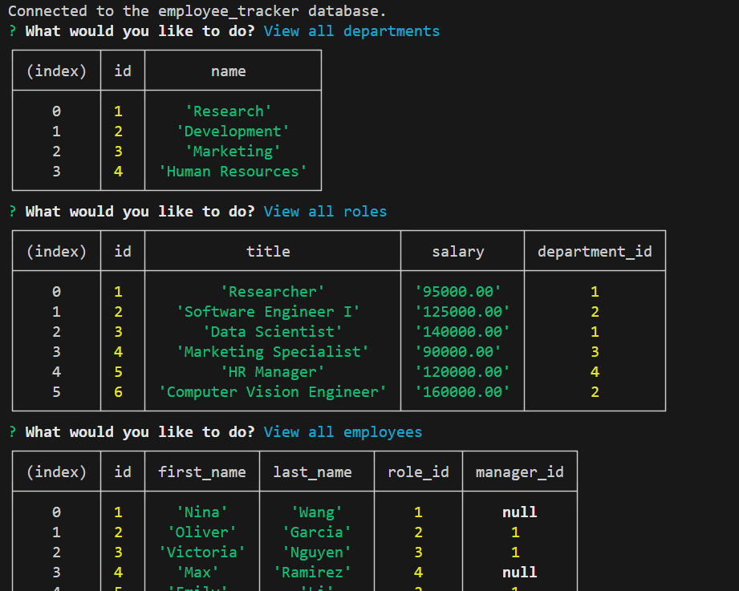

# Employee Tracker

[Video Demo](https://drive.google.com/file/d/1wfhhum6WtU-OxgCgfFYOCOfBZzDF-mCc/view?usp=sharing)

## Description

The Employee Tracker is a command-line application that allows users to manage employee information within a company. It provides functionality to view all departments, roles, and employees, as well as add new departments, roles, and employees. Additionally, users can update an employee's role.

The Employee Tracker application is built using Node.js and MySQL. It utilizes the Inquirer package for the command-line interface and MySQL2 package for interacting with the MySQL database. By completing this project, I have gained practical experience in using JavaScript, Node.js, MySQL, and working with databases.

## Table of Contents

- [Installation](#installation)
- [Usage](#usage)
- [Features](#features)
- [Contributing](#contributing)
- [License](#license)
- [Questions](#questions)

## Installation

To install and use the Employee Tracker, follow these steps:

1. Clone the repository to your local machine.
2. Navigate to the root directory of the repository.
3. Run `npm install` to install the required dependencies.
4. Set up your MySQL database by executing the provided schema.sql and seeds.sql files.
5. Create a `.env` file in the root directory and provide your MySQL database credentials.
6. Run `node index.js` to start the application.

## Usage

Once the application is running, you will be presented with a list of options to choose from. Use the arrow keys to navigate and press Enter to select an option. The available options include:

- View all departments
- View all roles
- View all employees
- Add a department
- Add a role
- Add an employee
- Update an employee role
- Quit

Selecting an option will prompt you for additional information if required. Follow the prompts and provide the necessary details to perform the desired action.

## Features

- View all departments, roles, and employees
- Add new departments, roles, and employees
- Update an employee's role
- Command-line interface for easy interaction
- Integration with MySQL database

## Contributing

Contributions to the Employee Tracker project are welcome! If you have any suggestions, enhancements, or bug fixes, please follow these steps to contribute:

1. Fork the repository to your own GitHub account.
2. Clone the repository to your local machine.
3. Create a new branch with a descriptive name (`git checkout -b my-branch`).
4. Make your changes and commit them (`git commit -m 'Add some feature'`).
5. Push the changes to your forked repository (`git push origin my-branch`).
6. Open a pull request in the main repository and provide a detailed description of your changes.

## License

This project is licensed under the MIT License. See the [LICENSE](./LICENSE) file for more information.

## Links

- GitHub Profile: [seantamturk](https://github.com/seantamturk)
- [Linkedin](https://www.linkedin.com/in/sean-tamturk-8253b722a/)
